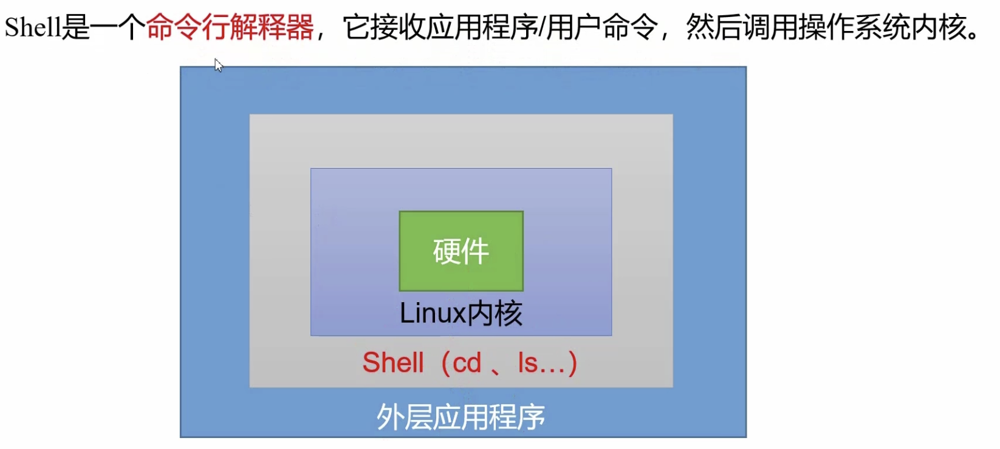

# Shell 概述

## shell 是什么？

如今的计算机有着多种多样的交互接口让我们可以进行指令的的输入，从炫酷的图像用户界面（GUI），语音输入甚至是 AR/VR 都已经无处不在。 这些交互接口可以覆盖 80% 的使用场景，但是它们也从根本上限制了您的操作方式——你不能点击一个不存在的按钮或者是用语音输入一个还没有被录入的指令。 为了充分利用计算机的能力，我们不得不回到最根本的方式，使用文字接口：Shell

几乎所有您能够接触到的平台都支持某种形式的 shell，有些甚至还提供了多种 shell 供您选择。虽然它们之间有些细节上的差异，但是其核心功能都是一样的：它允许你执行程序，输入并获取某种半结构化的输出。

本节课我们会使用 *Bourne Again SHell, 简称 “bash”* 。 这是被最广泛使用的一种 shell，它的语法和其他的 shell 都是类似的。



## Shell 脚本入门

### 脚本格式

脚本以 `#！/bin/bash` 开头（指定解析器）

第一个 Shell 脚本：helloworld.sh

需求：创建一个 Shell 脚本，输出 helloworld 

案例实操： 

```shell
touch helloworld.sh
vim helloworld.sh
#在 helloworld.sh 中输入如下内容 
#!/bin/bash 
echo "helloworld"
sh helloworld.sh
```

3）脚本的常用执行方式 

第一种：采用 bash 或 sh+脚本的相对路径或绝对路径（不用赋予脚本+x 权限） 

sh+脚本的相对路径 

`sh ./helloworld.sh` 


sh+脚本的绝对路径 

`sh /home/atguigu/shells/helloworld.sh` 

bash+脚本的相对路径 

`bash ./helloworld.sh` 

bash+脚本的绝对路径 

`bash /home/atguigu/shells/helloworld.sh` 

第二种：采用输入脚本的绝对路径或相对路径执行脚本（必须具有可执行权限+x） 

①首先要赋予 helloworld.sh 脚本的+x 权限 

`chmod +x helloworld.sh` 

②执行脚本 

相对路径 

 `./helloworld.sh` 

绝对路径 

`/home/atguigu/shells/helloworld.sh` 

注意：第一种执行方法，本质是 bash 解析器帮你执行脚本，所以脚本本身不需要执行权限。第二种执行方法，本质是脚本需要自己执行，所以需要执行权限。 

【了解】第三种：在脚本的路径前加上“`.`”或者 `source` 

①有以下脚本 

```shell
[atguigu@hadoop101 shells]$ cat test.sh 
#!/bin/bash 
A=5 
echo $A 
```

②分别使用 `sh`，`bash`，`./` 和 `.` 的方式来执行，结果如下：

```
[atguigu@hadoop101 shells]$ bash test.sh 
[atguigu@hadoop101 shells]$ echo $A 

[atguigu@hadoop101 shells]$ sh test.sh 
[atguigu@hadoop101 shells]$ echo $A 

[atguigu@hadoop101 shells]$ ./test.sh 
[atguigu@hadoop101 shells]$ echo $A 

[atguigu@hadoop101 shells]$ . test.sh 
[atguigu@hadoop101 shells]$ echo $A 
5
```

原因： 

前两种方式都是在当前 shell 中打开一个子 shell 来执行脚本内容，当脚本内容结束，则 子 shell 关闭，回到父 shell 中。 

第三种，也就是使用在脚本路径前加“.”或者 source 的方式，可以使脚本内容在当前 shell 里执行，而无需打开子 shell！这也是为什么我们每次要修改完/etc/profile 文件以后，需 要 source 一下的原因。 

开子 shell 与不开子 shell 的区别就在于，环境变量的继承关系，如在子 shell 中设置的 当前变量，父 shell 是不可见的。 


## Bash的模式扩展

### 简介

Shell 接收到用户输入的命令以后，会根据空格将用户的输入，拆分成一个个词元（token）。然后，Shell 会扩展词元里面的特殊字符，扩展完成后才会调用相应的命令。

这种特殊字符的扩展，称为模式扩展（globbing）。其中有些用到通配符，又称为通配符扩展（wildcard expansion）。Bash 一共提供八种扩展。

- 波浪线扩展
- `?` 字符扩展
- `*` 字符扩展
- 方括号扩展
- 大括号扩展
- 变量扩展
- 子命令扩展
- 算术扩展

本章介绍这八种扩展。

Bash 是先进行扩展，再执行命令。因此，扩展的结果是由 Bash 负责的，与所要执行的命令无关。命令本身并不存在参数扩展，收到什么参数就原样执行。这一点务必需要记住。

模块扩展的英文单词是`globbing`，这个词来自于早期的 Unix 系统有一个`/etc/glob`文件，保存扩展的模板。后来 Bash 内置了这个功能，但是这个名字就保留了下来。

模式扩展与正则表达式的关系是，模式扩展早于正则表达式出现，可以看作是原始的正则表达式。它的功能没有正则那么强大灵活，但是优点是简单和方便。

Bash 允许用户关闭扩展。

```
$ set -o noglob
# 或者
$ set -f
```

下面的命令可以重新打开扩展。

```
$ set +o noglob
# 或者
$ set +f
```

### 波浪线扩展

*波浪线`~`会自动扩展成当前用户的主目录。*

```
$ echo ~
/home/me
```

`~/dir`表示扩展成主目录的某个子目录，`dir`是主目录里面的一个子目录名。

```
# 进入 /home/me/foo 目录
$ cd ~/foo
```

`~user`表示扩展成用户`user`的主目录。

```
$ echo ~foo
/home/foo

$ echo ~root
/root
```

上面例子中，Bash 会根据波浪号后面的用户名，返回该用户的主目录。

如果`~user`的`user`是不存在的用户名，则波浪号扩展不起作用。

```
$ echo ~nonExistedUser
~nonExistedUser
```

`~+`会扩展成当前所在的目录，等同于`pwd`命令。

```
$ cd ~/foo
$ echo ~+
/home/me/foo
```

### `?` 字符扩展

*`?`字符代表文件路径里面的任意单个字符，不包括空字符。*比如，`Data???`匹配所有`Data`后面跟着三个字符的文件名。

```
# 存在文件 a.txt 和 b.txt
$ ls ?.txt
a.txt b.txt
```

上面命令中，`?`表示单个字符，所以会同时匹配`a.txt`和`b.txt`。

如果匹配多个字符，就需要多个`?`连用。

```
# 存在文件 a.txt、b.txt 和 ab.txt
$ ls ??.txt
ab.txt
```

上面命令中，`??`匹配了两个字符。

`?` 字符扩展属于文件名扩展，只有文件确实存在的前提下，才会发生扩展。如果文件不存在，扩展就不会发生。

```
# 当前目录有 a.txt 文件
$ echo ?.txt
a.txt

# 当前目录为空目录
$ echo ?.txt
?.txt
```

上面例子中，如果`?.txt`可以扩展成文件名，`echo`命令会输出扩展后的结果；如果不能扩展成文件名，`echo`就会原样输出`?.txt`。

### `*` 字符扩展

*`*`字符代表文件路径里面的任意数量的任意字符，包括零个字符。*

```
# 存在文件 a.txt、b.txt 和 ab.txt
$ ls *.txt
a.txt b.txt ab.txt
```

上面例子中，`*.txt`代表后缀名为`.txt`的所有文件。

如果想输出当前目录的所有文件，直接用`*`即可。

```
$ ls *
```

`*`可以匹配空字符，下面是一个例子。

```
# 存在文件 a.txt、b.txt 和 ab.txt
$ ls a*.txt
a.txt ab.txt

$ ls *b*
b.txt ab.txt
```

*注意，`*`不会匹配隐藏文件（以`.`开头的文件），即`ls *`不会输出隐藏文件。*

*如果要匹配隐藏文件，需要写成`.*`。*

```
# 显示所有隐藏文件
$ echo .*
```

如果要匹配隐藏文件，同时要排除`.`和`..`这两个特殊的隐藏文件，可以与方括号扩展结合使用，写成`.[!.]*`。

```
$ echo .[!.]*
```

注意，`*`字符扩展属于文件名扩展，只有文件确实存在的前提下才会扩展。如果文件不存在，就会原样输出。

```
# 当前目录不存在 c 开头的文件
$ echo c*.txt
c*.txt
```

上面例子中，当前目录里面没有`c`开头的文件，导致`c*.txt`会原样输出。

`*`只匹配当前目录，不会匹配子目录。

```
# 子目录有一个 a.txt
# 无效的写法
$ ls *.txt

# 有效的写法
$ ls */*.txt
```

上面的例子，文本文件在子目录，`*.txt`不会产生匹配，必须写成`*/*.txt`。有几层子目录，就必须写几层星号。

Bash 4.0 引入了一个参数`globstar`，当该参数打开时，允许`**`匹配零个或多个子目录。因此，`**/*.txt`可以匹配顶层的文本文件和任意深度子目录的文本文件。详细介绍请看后面`shopt`命令的介绍。

### 方括号扩展

*方括号扩展的形式是`[...]`，只有文件确实存在的前提下才会扩展。如果文件不存在，就会原样输出括号之中的任意一个字符。*

比如，`[aeiou]`可以匹配五个元音字母中的任意一个。

```
# 存在文件 a.txt 和 b.txt
$ ls [ab].txt
a.txt b.txt

# 只存在文件 a.txt
$ ls [ab].txt
a.txt
```

上面例子中，`[ab]`可以匹配`a`或`b`，前提是确实存在相应的文件。

方括号扩展属于文件名匹配，即扩展后的结果必须符合现有的文件路径。如果不存在匹配，就会保持原样，不进行扩展。

```
# 不存在文件 a.txt 和 b.txt
$ ls [ab].txt
ls: 无法访问'[ab].txt': 没有那个文件或目录
```

上面例子中，由于扩展后的文件不存在，`[ab].txt`就原样输出了，导致`ls`命名报错。

*方括号扩展还有两种变体：`[^...]`和`[!...]`。它们表示匹配不在方括号里面的字符，这两种写法是等价的。*比如，`[^abc]`或`[!abc]`表示匹配除了`a`、`b`、`c`以外的字符。

```
# 存在 aaa、bbb、aba 三个文件
$ ls ?[!a]?
aba bbb
```

上面命令中，`[!a]`表示文件名第二个字符不是`a`的文件名，所以返回了`aba`和`bbb`两个文件。

注意，如果需要匹配`[`字符，可以放在方括号内，比如`[[aeiou]`。如果需要匹配连字号`-`，只能放在方括号内部的开头或结尾，比如`[-aeiou]`或`[aeiou-]`。

### [start-end] 扩展

*方括号扩展有一个简写形式`[start-end]`，表示匹配一个连续的范围。*

比如，`[a-c]`等同于`[abc]`，`[0-9]`匹配`[0123456789]`。

```
# 存在文件 a.txt、b.txt 和 c.txt
$ ls [a-c].txt
a.txt
b.txt
c.txt

# 存在文件 report1.txt、report2.txt 和 report3.txt
$ ls report[0-9].txt
report1.txt
report2.txt
report3.txt
...
```

下面是一些常用简写的例子。

- `[a-z]`：所有小写字母。
- `[a-zA-Z]`：所有小写字母与大写字母。
- `[a-zA-Z0-9]`：所有小写字母、大写字母与数字。
- `[abc]*`：所有以`a`、`b`、`c`字符之一开头的文件名。
- `program.[co]`：文件`program.c`与文件`program.o`。
- `BACKUP.[0-9][0-9][0-9]`：所有以`BACKUP.`开头，后面是三个数字的文件名。

*这种简写形式有一个否定形式`[!start-end]`，表示匹配不属于这个范围的字符。*比如，`[!a-zA-Z]`表示匹配非英文字母的字符。

```
$ ls report[!1–3].txt
report4.txt report5.txt
```

上面代码中，`[!1-3]`表示排除1、2和3。

### 大括号扩展

*大括号扩展`{...}`表示分别扩展成大括号里面的所有值，各个值之间使用逗号分隔。*比如，`{1,2,3}`扩展成`1 2 3`。

```
$ echo {1,2,3}
1 2 3

$ echo d{a,e,i,u,o}g
dag deg dig dug dog

$ echo Front-{A,B,C}-Back
Front-A-Back Front-B-Back Front-C-Back
```

注意，大括号扩展不是文件名扩展。它会扩展成所有给定的值，而不管是否有对应的文件存在。

```
$ ls {a,b,c}.txt
ls: 无法访问'a.txt': 没有那个文件或目录
ls: 无法访问'b.txt': 没有那个文件或目录
ls: 无法访问'c.txt': 没有那个文件或目录
```

上面例子中，即使不存在对应的文件，`{a,b,c}`依然扩展成三个文件名，导致`ls`命令报了三个错误。

*另一个需要注意的地方是，大括号内部的逗号前后不能有空格。否则，大括号扩展会失效。*

```
$ echo {1 , 2}
{1 , 2}
```

上面例子中，逗号前后有空格，Bash 就会认为这不是大括号扩展，而是三个独立的参数。

*逗号前面可以没有值，表示扩展的第一项为空。*

```
$ cp a.log{,.bak}

# 等同于
# cp a.log a.log.bak
```

*大括号可以嵌套。*

```
$ echo {j{p,pe}g,png}
jpg jpeg png

$ echo a{A{1,2},B{3,4}}b
aA1b aA2b aB3b aB4b
```

*大括号也可以与其他模式联用，并且总是先于其他模式进行扩展。*

```
$ echo /bin/{cat,b*}
/bin/cat /bin/b2sum /bin/base32 /bin/base64 ... ...

# 基本等同于
$ echo /bin/cat;echo /bin/b*
```

上面例子中，会先进行大括号扩展，然后进行`*`扩展，等同于执行两条`echo`命令。

大括号可以用于多字符的模式，方括号不行（只能匹配单字符）。

```
$ echo {cat,dog}
cat dog
```

由于大括号扩展`{...}`不是文件名扩展，所以它总是会扩展的。这与方括号扩展`[...]`完全不同，如果匹配的文件不存在，方括号就不会扩展。这一点要注意区分。

```
# 不存在 a.txt 和 b.txt
$ echo [ab].txt
[ab].txt

$ echo {a,b}.txt
a.txt b.txt
```

上面例子中，如果不存在`a.txt`和`b.txt`，那么`[ab].txt`就会变成一个普通的文件名，而`{a,b}.txt`可以照样扩展。

### {start..end} 扩展

*大括号扩展有一个简写形式`{start..end}`，表示扩展成一个连续序列。*比如，`{a..z}`可以扩展成26个小写英文字母。

```
$ echo {a..c}
a b c

$ echo d{a..d}g
dag dbg dcg ddg

$ echo {1..4}
1 2 3 4

$ echo Number_{1..5}
Number_1 Number_2 Number_3 Number_4 Number_5
```

*这种简写形式支持逆序。*

```
$ echo {c..a}
c b a

$ echo {5..1}
5 4 3 2 1
```

注意，如果遇到无法理解的简写，大括号模式就会原样输出，不会扩展。

```
$ echo {a1..3c}
{a1..3c}
```

这种简写形式可以嵌套使用，形成复杂的扩展。

```
$ echo .{mp{3..4},m4{a,b,p,v}}
.mp3 .mp4 .m4a .m4b .m4p .m4v
```

大括号扩展的常见用途为新建一系列目录。

```
$ mkdir {2007..2009}-{01..12}
```

上面命令会新建36个子目录，每个子目录的名字都是”年份-月份“。

这个写法的另一个常见用途，是直接用于`for`循环。

```
for i in {1..4}
do
  echo $i
done
```

上面例子会循环4次。

*如果整数前面有前导`0`，扩展输出的每一项都有前导`0`。*

```
$ echo {01..5}
01 02 03 04 05

$ echo {001..5}
001 002 003 004 005
```

*这种简写形式还可以使用第二个双点号`start..end..step`，用来指定扩展的步长。*

```
$ echo {0..8..2}
0 2 4 6 8
```

上面代码将`0`扩展到`8`，每次递增的长度为`2`，所以一共输出5个数字。

多个简写形式连用，会有循环处理的效果。

```
$ echo {a..c}{1..3}
a1 a2 a3 b1 b2 b3 c1 c2 c3
```

### 变量扩展

*Bash 将美元符号`$`开头的词元视为变量，将其扩展成变量值，*详见《Bash 变量》一章。

```
$ echo $SHELL
/bin/bash
```

变量名除了放在美元符号后面，也可以放在`${}`里面。

```
$ echo ${SHELL}
/bin/bash
```

*`${!string*}`或`${!string@}`返回所有匹配给定字符串`string`的变量名。*

```
$ echo ${!S*}
SECONDS SHELL SHELLOPTS SHLVL SSH_AGENT_PID SSH_AUTH_SOCK
```

上面例子中，`${!S*}`扩展成所有以`S`开头的变量名。

### 子命令扩展

`$(...)`可以扩展成另一个命令的运行结果，该命令的所有输出都会作为返回值。

```
$ echo $(date)
Tue Jan 28 00:01:13 CST 2020
```

上面例子中，`$(date)`返回`date`命令的运行结果。

还有另一种较老的语法，子命令放在反引号之中，也可以扩展成命令的运行结果。

```
$ echo `date`
Tue Jan 28 00:01:13 CST 2020
```

`$(...)`可以嵌套，比如`$(ls $(pwd))`。

### 算术扩展

`$((...))`可以扩展成整数运算的结果，详见《Bash 的算术运算》一章。

```
$ echo $((2 + 2))
4
```

### 字符类

`[[:class:]]`表示一个字符类，扩展成某一类特定字符之中的一个。常用的字符类如下。

- `[[:alnum:]]`：匹配任意英文字母与数字
- `[[:alpha:]]`：匹配任意英文字母
- `[[:blank:]]`：空格和 Tab 键。
- `[[:cntrl:]]`：ASCII 码 0-31 的不可打印字符。
- `[[:digit:]]`：匹配任意数字 0-9。
- `[[:graph:]]`：A-Z、a-z、0-9 和标点符号。
- `[[:lower:]]`：匹配任意小写字母 a-z。
- `[[:print:]]`：ASCII 码 32-127 的可打印字符。
- `[[:punct:]]`：标点符号（除了 A-Z、a-z、0-9 的可打印字符）。
- `[[:space:]]`：空格、Tab、LF（10）、VT（11）、FF（12）、CR（13）。
- `[[:upper:]]`：匹配任意大写字母 A-Z。
- `[[:xdigit:]]`：16进制字符（A-F、a-f、0-9）。

请看下面的例子。

```
$ echo [[:upper:]]*
```

上面命令输出所有大写字母开头的文件名。

字符类的第一个方括号后面，可以加上感叹号`!`，表示否定。比如，`[![:digit:]]`匹配所有非数字。

```
$ echo [![:digit:]]*
```

上面命令输出所有不以数字开头的文件名。

字符类也属于文件名扩展，如果没有匹配的文件名，字符类就会原样输出。

```
# 不存在以大写字母开头的文件
$ echo [[:upper:]]*
[[:upper:]]*
```

上面例子中，由于没有可匹配的文件，字符类就原样输出了。

### 使用注意点

通配符有一些使用注意点，不可不知。

**（1）通配符是先解释，再执行。**

Bash 接收到命令以后，发现里面有通配符，会进行通配符扩展，然后再执行命令。

```
$ ls a*.txt
ab.txt
```

上面命令的执行过程是，Bash 先将`a*.txt`扩展成`ab.txt`，然后再执行`ls ab.txt`。

**（2）文件名扩展在不匹配时，会原样输出。**

文件名扩展在没有可匹配的文件时，会原样输出。

```
# 不存在 r 开头的文件名
$ echo r*
r*
```

上面代码中，由于不存在`r`开头的文件名，`r*`会原样输出。

下面是另一个例子。

```
$ ls *.csv
ls: *.csv: No such file or directory
```

另外，前面已经说过，大括号扩展`{...}`不是文件名扩展。

**（3）只适用于单层路径。**

所有文件名扩展只匹配单层路径，不能跨目录匹配，即无法匹配子目录里面的文件。或者说，`?`或`*`这样的通配符，不能匹配路径分隔符（`/`）。

如果要匹配子目录里面的文件，可以写成下面这样。

```
$ ls */*.txt
```

Bash 4.0 新增了一个`globstar`参数，允许`**`匹配零个或多个子目录，详见后面`shopt`命令的介绍。

**（4）文件名可以使用通配符。**

Bash 允许文件名使用通配符，即文件名包括特殊字符。这时引用文件名，需要把文件名放在单引号或双引号里面。

```
$ touch 'fo*'
$ ls
fo*
```

上面代码创建了一个`fo*`文件，这时`*`就是文件名的一部分。

### 量词语法

量词语法用来控制模式匹配的次数。它只有在 Bash 的`extglob`参数打开的情况下才能使用，不过一般是默认打开的。下面的命令可以查询。

```
$ shopt extglob
extglob        	on
```

如果`extglob`参数是关闭的，可以用下面的命令打开。

```
$ shopt -s extglob
```

量词语法有下面几个。

- `?(pattern-list)`：模式匹配零次或一次。
- `*(pattern-list)`：模式匹配零次或多次。
- `+(pattern-list)`：模式匹配一次或多次。
- `@(pattern-list)`：只匹配一次模式。
- `!(pattern-list)`：匹配给定模式以外的任何内容。

```
$ ls abc?(.)txt
abctxt abc.txt
```

上面例子中，`?(.)`匹配零个或一个点。

```
$ ls abc?(def)
abc abcdef
```

上面例子中，`?(def)`匹配零个或一个`def`。

```
$ ls abc@(.txt|.php)
abc.php abc.txt
```

上面例子中，`@(.txt|.php)`匹配文件有且只有一个`.txt`或`.php`后缀名。

```
$ ls abc+(.txt)
abc.txt abc.txt.txt
```

上面例子中，`+(.txt)`匹配文件有一个或多个`.txt`后缀名。

```
$ ls a!(b).txt
a.txt abb.txt ac.txt
```

上面例子中，`!(b)`表示匹配单个字母`b`以外的任意内容，所以除了`ab.txt`以外，其他文件名都能匹配。

量词语法也属于文件名扩展，如果不存在可匹配的文件，就会原样输出。

```
# 没有 abc 开头的文件名
$ ls abc?(def)
ls: 无法访问'abc?(def)': 没有那个文件或目录
```

上面例子中，由于没有可匹配的文件，`abc?(def)`就原样输出，导致`ls`命令报错。

### shopt 命令

`shopt`命令可以调整 Bash 的行为。它有好几个参数跟通配符扩展有关。

`shopt`命令的使用方法如下。

```
# 打开某个参数
$ shopt -s [optionname]

# 关闭某个参数
$ shopt -u [optionname]

# 查询某个参数关闭还是打开
$ shopt [optionname]
```

**（1）dotglob 参数**

`dotglob`参数可以让扩展结果包括隐藏文件（即点开头的文件）。

正常情况下，扩展结果不包括隐藏文件。

```
$ ls *
abc.txt
```

打开`dotglob`，就会包括隐藏文件。

```
$ shopt -s dotglob
$ ls *
abc.txt .config
```

**（2）nullglob 参数**

`nullglob`参数可以让通配符不匹配任何文件名时，返回空字符。

默认情况下，通配符不匹配任何文件名时，会保持不变。

```
$ rm b*
rm: 无法删除'b*': 没有那个文件或目录
```

上面例子中，由于当前目录不包括`b`开头的文件名，导致`b*`不会发生文件名扩展，保持原样不变，所以`rm`命令报错没有`b*`这个文件。

打开`nullglob`参数，就可以让不匹配的通配符返回空字符串。

```
$ shopt -s nullglob
$ rm b*
rm: 缺少操作数
```

上面例子中，由于没有`b*`匹配的文件名，所以`rm b*`扩展成了`rm`，导致报错变成了”缺少操作数“。

**（3）failglob 参数**

`failglob`参数使得通配符不匹配任何文件名时，Bash 会直接报错，而不是让各个命令去处理。

```
$ shopt -s failglob
$ rm b*
bash: 无匹配: b*
```

上面例子中，打开`failglob`以后，由于`b*`不匹配任何文件名，Bash 直接报错了，不再让`rm`命令去处理。

**（4）extglob 参数**

`extglob`参数使得 Bash 支持 ksh 的一些扩展语法。它默认应该是打开的。

```
$ shopt extglob
extglob        	on
```

它的主要应用是支持量词语法。如果不希望支持量词语法，可以用下面的命令关闭。

```
$ shopt -u extglob
```

**（5）nocaseglob 参数**

`nocaseglob`参数可以让通配符扩展不区分大小写。

```
$ shopt -s nocaseglob
$ ls /windows/program*
/windows/ProgramData
/windows/Program Files
/windows/Program Files (x86)
```

上面例子中，打开`nocaseglob`以后，`program*`就不区分大小写了，可以匹配`ProgramData`等。

**（6）globstar 参数**

`globstar`参数可以使得`**`匹配零个或多个子目录。该参数默认是关闭的。

假设有下面的文件结构。

```
a.txt
sub1/b.txt
sub1/sub2/c.txt
```

上面的文件结构中，顶层目录、第一级子目录`sub1`、第二级子目录`sub1\sub2`里面各有一个文本文件。请问怎样才能使用通配符，将它们显示出来？

默认情况下，只能写成下面这样。

```
$ ls *.txt */*.txt */*/*.txt
a.txt  sub1/b.txt  sub1/sub2/c.txt
```

这是因为`*`只匹配当前目录，如果要匹配子目录，只能一层层写出来。

打开`globstar`参数以后，`**`匹配零个或多个子目录。因此，`**/*.txt`就可以得到想要的结果。

```
$ shopt -s globstar
$ ls **/*.txt
a.txt  sub1/b.txt  sub1/sub2/c.txt
```


## 引号和转义

Bash 只有一种数据类型，就是字符串。不管用户输入什么数据，Bash 都视为字符串。因此，字符串相关的引号和转义，对 Bash 来说就非常重要。

### 转义

某些字符在 Bash 里面有特殊含义（比如`$`、`&`、`*`）。

```
$ echo $date

$
```

上面例子中，输出`$date`不会有任何结果，因为`$`是一个特殊字符。

如果想要原样输出这些特殊字符，就必须在它们前面加上反斜杠，使其变成普通字符。这就叫做“转义”（escape）。

```
$ echo \$date
$date
```

上面命令中，只有在特殊字符`$`前面加反斜杠，才能原样输出。

反斜杠本身也是特殊字符，如果想要原样输出反斜杠，就需要对它自身转义，连续使用两个反斜线（`\\`）。

```
$ echo \\
\
```

上面例子输出了反斜杠本身。

反斜杠除了用于转义，还可以表示一些不可打印的字符。

- `\a`：响铃
- `\b`：退格
- `\n`：换行
- `\r`：回车
- `\t`：制表符

如果想要在命令行使用这些不可打印的字符，可以把它们放在引号里面，然后使用`echo`命令的`-e`参数。

```
$ echo a\tb
atb

$ echo -e "a\tb"
a        b
```

上面例子中，命令行直接输出不可打印字符`\t`，Bash 不能正确解释。必须把它们放在引号之中，然后使用`echo`命令的`-e`参数。

*换行符是一个特殊字符，表示命令的结束，Bash 收到这个字符以后，就会对输入的命令进行解释执行。换行符前面加上反斜杠转义，就使得换行符变成一个普通字符，Bash 会将其当作长度为`0`的空字符处理，从而可以将一行命令写成多行。*

```
$ mv \
/path/to/foo \
/path/to/bar

# 等同于
$ mv /path/to/foo /path/to/bar
```

上面例子中，如果一条命令过长，就可以在行尾使用反斜杠，将其改写成多行。这是常见的多行命令的写法。

### 单引号

Bash 允许字符串放在单引号或双引号之中，加以引用。

*单引号用于保留字符的字面含义，各种特殊字符在单引号里面，都会变为普通字符*，比如星号（`*`）、美元符号（`$`）、反斜杠（`\`）等。

```
$ echo '*'
*

$ echo '$USER'
$USER

$ echo '$((2+2))'
$((2+2))

$ echo '$(echo foo)'
$(echo foo)
```

上面命令中，单引号使得 Bash 扩展、变量引用、算术运算和子命令，都失效了。如果不使用单引号，它们都会被 Bash 自动扩展。

由于反斜杠在单引号里面变成了普通字符，所以如果单引号之中，还要使用单引号，不能使用转义，需要在外层的单引号前面加上一个美元符号（`$`），然后再对里层的单引号转义。

```
# 不正确
$ echo it's

# 不正确
$ echo 'it\'s'

# 正确
$ echo $'it\'s'
```

不过，更合理的方法是改在双引号之中使用单引号。

```
$ echo "it's"
it's
```

### 双引号

双引号比单引号宽松，大部分特殊字符在双引号里面，都会失去特殊含义，变成普通字符。

```
$ echo "*"
*
```

上面例子中，通配符`*`是一个特殊字符，放在双引号之中，就变成了普通字符，会原样输出。这一点需要特别留意，这意味着，双引号里面不会进行文件名扩展。

但是，*三个特殊字符除外：美元符号（`$`）、反引号（```）和反斜杠（`\`）。这三个字符在双引号之中，依然有特殊含义，会被 Bash 自动扩展。*

```
$ echo "$SHELL"
/bin/bash

$ echo "`date`"
Mon Jan 27 13:33:18 CST 2020
```

上面例子中，美元符号（`$`）和反引号（```）在双引号中，都保持特殊含义。美元符号用来引用变量，反引号则是执行子命令。

```
$ echo "I'd say: \"hello!\""
I'd say: "hello!"

$ echo "\\"
\
```

上面例子中，反斜杠在双引号之中保持特殊含义，用来转义。所以，可以使用反斜杠，在双引号之中插入双引号，或者插入反斜杠本身。

换行符在双引号之中，会失去特殊含义，Bash 不再将其解释为命令的结束，只是作为普通的换行符。所以可以利用双引号，在命令行输入多行文本。

```
$ echo "hello
world"
hello
world
```

上面命令中，Bash 正常情况下会将换行符解释为命令结束，但是换行符在双引号之中就失去了这种特殊作用，只用来换行，所以可以输入多行。`echo`命令会将换行符原样输出，显示的时候正常解释为换行。

*双引号的另一个常见的使用场合是，文件名包含空格。这时就必须使用双引号（或单引号），将文件名放在里面。*

```
$ ls "two words.txt"
```

上面命令中，`two words.txt`是一个包含空格的文件名，如果不放在双引号里面，就会被 Bash 当作两个文件。

双引号会原样保存多余的空格。

```
$ echo "this is a     test"
this is a     test
```

双引号还有一个作用，就是保存原始命令的输出格式。

```
# 单行输出
$ echo $(cal)
一月 2020 日 一 二 三 四 五 六 1 2 3 ... 31

# 原始格式输出
$ echo "$(cal)"
      一月 2020
日 一 二 三 四 五 六
          1  2  3  4
 5  6  7  8  9 10 11
12 13 14 15 16 17 18
19 20 21 22 23 24 25
26 27 28 29 30 31
```

上面例子中，如果`$(cal)`不放在双引号之中，`echo`就会将所有结果以单行输出，丢弃了所有原始的格式。

### Here 文档

Here 文档（here document）是一种输入多行字符串的方法，格式如下。

```
<< token
text
token
```

*它的格式分成开始标记（`<< token`）和结束标记（`token`）。开始标记是两个小于号 + Here 文档的名称，名称可以随意取，后面必须是一个换行符；结束标记是单独一行顶格写的 Here 文档名称，如果不是顶格，结束标记不起作用。两者之间就是多行字符串的内容。*

下面是一个通过 Here 文档输出 HTML 代码的例子。

```
$ cat << _EOF_
<html>
<head>
    <title>
    The title of your page
    </title>
</head>

<body>
    Your page content goes here.
</body>
</html>
_EOF_
```

Here 文档内部会发生变量替换，同时支持反斜杠转义，但是不支持通配符扩展，双引号和单引号也失去语法作用，变成了普通字符。

```
$ foo='hello world'
$ cat << _example_
$foo
"$foo"
'$foo'
_example_

hello world
"hello world"
'hello world'
```

上面例子中，变量`$foo`发生了替换，但是双引号和单引号都原样输出了，表明它们已经失去了引用的功能。

如果不希望发生变量替换，可以把 Here 文档的开始标记放在单引号之中。

```
$ foo='hello world'
$ cat << '_example_'
$foo
"$foo"
'$foo'
_example_

$foo
"$foo"
'$foo'
```

上面例子中，Here 文档的开始标记（`_example_`）放在单引号之中，导致变量替换失效了。

Here 文档的本质是重定向，它将字符串重定向输出给某个命令，相当于包含了`echo`命令。

```
$ command << token
  string
token

# 等同于

$ echo string | command
```

上面代码中，Here 文档相当于`echo`命令的重定向。

所以，Here 字符串只适合那些可以接受标准输入作为参数的命令，对于其他命令无效，比如`echo`命令就不能用 Here 文档作为参数。

```
$ echo << _example_
hello
_example_
```

上面例子不会有任何输出，因为 Here 文档对于`echo`命令无效。

此外，Here 文档也不能作为变量的值，只能用于命令的参数。

### Here 字符串

Here 文档还有一个变体，叫做 Here 字符串（Here string），使用三个小于号（`<<<`）表示。

```
<<< string
```

它的作用是将字符串通过标准输入，传递给命令。

有些命令直接接受给定的参数，与通过标准输入接受参数，结果是不一样的。所以才有了这个语法，使得将字符串通过标准输入传递给命令更方便，比如`cat`命令只接受标准输入传入的字符串。

```
$ cat <<< 'hi there'
# 等同于
$ echo 'hi there' | cat
```

上面的第一种语法使用了 Here 字符串，要比第二种语法看上去语义更好，也更简洁。

```
$ md5sum <<< 'ddd'
# 等同于
$ echo 'ddd' | md5sum
```

上面例子中，`md5sum`命令只能接受标准输入作为参数，不能直接将字符串放在命令后面，会被当作文件名，即`md5sum ddd`里面的`ddd`会被解释成文件名。这时就可以用 Here 字符串，将字符串传给`md5sum`命令。

## Bash 变量

### 简介

Bash 变量分成环境变量和自定义变量两类。

#### 环境变量

*环境变量是 Bash 环境自带的变量，进入 Shell 时已经定义好了，可以直接使用。它们通常是系统定义好的，也可以由用户从父 Shell 传入子 Shell。*

`env`命令或`printenv`命令，可以显示所有环境变量。

```
$ env
# 或者
$ printenv
```

下面是一些常见的环境变量。

- `BASHPID`：Bash 进程的进程 ID。
- `BASHOPTS`：当前 Shell 的参数，可以用`shopt`命令修改。
- `DISPLAY`：图形环境的显示器名字，通常是`:0`，表示 X Server 的第一个显示器。
- `EDITOR`：默认的文本编辑器。
- `HOME`：用户的主目录。
- `HOST`：当前主机的名称。
- `IFS`：词与词之间的分隔符，默认为空格。
- `LANG`：字符集以及语言编码，比如`zh_CN.UTF-8`。
- `PATH`：*由冒号分开的目录列表，当输入可执行程序名后，会搜索这个目录列表。*
- `PS1`：Shell 提示符。
- `PS2`： 输入多行命令时，次要的 Shell 提示符。
- `PWD`：当前工作目录。
- `RANDOM`：返回一个0到32767之间的随机数。
- `SHELL`：Shell 的名字。
- `SHELLOPTS`：启动当前 Shell 的`set`命令的参数，参见《set 命令》一章。
- `TERM`：终端类型名，即终端仿真器所用的协议。
- `UID`：当前用户的 ID 编号。
- `USER`：当前用户的用户名。

很多环境变量很少发生变化，而且是只读的，可以视为常量。由于它们的变量名全部都是大写，所以传统上，如果用户要自己定义一个常量，也会使用全部大写的变量名。

注意，Bash 变量名区分大小写，`HOME`和`home`是两个不同的变量。

查看单个环境变量的值，可以使用`printenv`命令或`echo`命令。

```
$ printenv PATH
# 或者
$ echo $PATH
```

注意，`printenv`命令后面的变量名，不用加前缀`$`。

#### 自定义变量

*自定义变量是用户在当前 Shell 里面自己定义的变量，仅在当前 Shell 可用。一旦退出当前 Shell，该变量就不存在了。*

`set`命令可以显示所有变量（包括环境变量和自定义变量），以及所有的 Bash 函数。

```
$ set
```

### 创建变量

用户创建变量的时候，变量名必须遵守下面的规则。

- 字母、数字和下划线字符组成。
- 第一个字符必须是一个字母或一个下划线，不能是数字。
- 不允许出现空格和标点符号。

变量声明的语法如下。

```
variable=value
```

上面命令中，等号左边是变量名，右边是变量。注意，等号两边不能有空格。

如果变量的值包含空格，则必须将值放在引号中。

```
myvar="hello world"
```

Bash 没有数据类型的概念，所有的变量值都是字符串。

下面是一些自定义变量的例子。

```
a=z                     # 变量 a 赋值为字符串 z
b="a string"            # 变量值包含空格，就必须放在引号里面
c="a string and $b"     # 变量值可以引用其他变量的值
d="\t\ta string\n"      # 变量值可以使用转义字符
e=$(ls -l foo.txt)      # 变量值可以是命令的执行结果
f=$((5 * 7))            # 变量值可以是数学运算的结果
```

变量可以重复赋值，后面的赋值会覆盖前面的赋值。

```
$ foo=1
$ foo=2
$ echo $foo
2
```

上面例子中，变量`foo`的第二次赋值会覆盖第一次赋值。

如果同一行定义多个变量，必须使用分号（`;`）分隔。

```
$ foo=1;bar=2
```

上面例子中，同一行定义了`foo`和`bar`两个变量。

### 读取变量

读*取变量的时候，直接在变量名前加上`$`就可以了。*

```
$ foo=bar
$ echo $foo
bar
```

*每当 Shell 看到以`$`开头的单词时，就会尝试读取这个变量名对应的值。*

*如果变量不存在，Bash 不会报错，而会输出空字符。*

由于`$`在 Bash 中有特殊含义，把它当作美元符号使用时，一定要非常小心，

```
$ echo The total is $100.00
The total is 00.00
```

上面命令的原意是输入`$100`，但是 Bash 将`$1`解释成了变量，该变量为空，因此输入就变成了`00.00`。所以，如果要使用`$`的原义，需要在`$`前面放上反斜杠，进行转义。

```
$ echo The total is \$100.00
The total is $100.00
```

*读取变量的时候，变量名也可以使用花括号`{}`包围，比如`$a`也可以写成`${a}`。这种写法可以用于变量名与其他字符连用的情况。*

```
$ a=foo
$ echo $a_file

$ echo ${a}_file
foo_file
```

上面代码中，变量名`a_file`不会有任何输出，因为 Bash 将其整个解释为变量，而这个变量是不存在的。只有用花括号区分`$a`，Bash 才能正确解读。

事实上，读取变量的语法`$foo`，可以看作是`${foo}`的简写形式。

*如果变量的值本身也是变量，可以使用`${!varname}`的语法，读取最终的值。*

```
$ myvar=USER
$ echo ${!myvar}
ruanyf
```

上面的例子中，变量`myvar`的值是`USER`，`${!myvar}`的写法将其展开成最终的值。

如果变量值包含连续空格（或制表符和换行符），最好放在双引号里面读取。

```
$ a="1 2  3"
$ echo $a
1 2 3
$ echo "$a"
1 2  3
```

*上面示例中，变量`a`的值包含两个连续空格。如果直接读取，Shell 会将连续空格合并成一个。只有放在双引号里面读取，才能保持原来的格式。*

### 删除变量

`unset`命令用来删除一个变量。

```
unset NAME
```

这个命令不是很有用。因为不存在的 Bash 变量一律等于空字符串，所以即使`unset`命令删除了变量，还是可以读取这个变量，值为空字符串。

所以，删除一个变量，也可以将这个变量设成空字符串。

```
$ foo=''
$ foo=
```

上面两种写法，都是删除了变量`foo`。由于不存在的值默认为空字符串，所以后一种写法可以在等号右边不写任何值。

### 输出变量，export 命令

用户创建的变量仅可用于当前 Shell，子 Shell 默认读取不到父 Shell 定义的变量。*为了把变量传递给子 Shell，需要使用`export`命令。这样输出的变量，对于子 Shell 来说就是环境变量。*

`export`命令用来向子 Shell 输出变量。

```
NAME=foo
export NAME
```

上面命令输出了变量`NAME`。变量的赋值和输出也可以在一个步骤中完成。

```
export NAME=value
```

上面命令执行后，当前 Shell 及随后新建的子 Shell，都可以读取变量`$NAME`。

子 Shell 如果修改继承的变量，不会影响父 Shell。

```
# 输出变量 $foo
$ export foo=bar

# 新建子 Shell
$ bash

# 读取 $foo
$ echo $foo
bar

# 修改继承的变量
$ foo=baz

# 退出子 Shell
$ exit

# 读取 $foo
$ echo $foo
bar
```

上面例子中，子 Shell 修改了继承的变量`$foo`，对父 Shell 没有影响。

### 特殊变量

Bash 提供一些特殊变量。这些变量的值由 Shell 提供，用户不能进行赋值。

（1）`$?`

`$?`为上一个命令的退出码，用来判断上一个命令是否执行成功。返回值是`0`，表示上一个命令执行成功；如果不是零，表示上一个命令执行失败。

```
$ ls doesnotexist
ls: doesnotexist: No such file or directory

$ echo $?
1
```

上面例子中，`ls`命令查看一个不存在的文件，导致报错。`$?`为1，表示上一个命令执行失败。

（2）`$$`

`$$`为当前 Shell 的进程 ID。

```
$ echo $$
10662
```

这个特殊变量可以用来命名临时文件。

```
LOGFILE=/tmp/output_log.$$
```

（3）`$_`

`$_`为上一个命令的最后一个参数。

```
$ grep dictionary /usr/share/dict/words
dictionary

$ echo $_
/usr/share/dict/words
```

（4）`$!`

`$!`为最近一个后台执行的异步命令的进程 ID。

```
$ firefox &
[1] 11064

$ echo $!
11064
```

上面例子中，`firefox`是后台运行的命令，`$!`返回该命令的进程 ID。

（5）`$0`

`$0`为当前 Shell 的名称（在命令行直接执行时）或者脚本名（在脚本中执行时）。

```
$ echo $0
bash
```

上面例子中，`$0`返回当前运行的是 Bash。

（6）`$-`

`$-`为当前 Shell 的启动参数。

```
$ echo $-
himBHs
```

（7）`$@`和`$#`

`$#`表示脚本的参数数量，`$@`表示脚本的参数值，参见脚本一章。

### 变量的默认值

Bash 提供四个特殊语法，跟变量的默认值有关，目的是保证变量不为空。

```
${varname:-word}
```

上面语法的含义是，如果变量`varname`存在且不为空，则返回它的值，否则返回`word`。它的目的是返回一个默认值，比如`${count:-0}`表示变量`count`不存在时返回`0`。

```
${varname:=word}
```

上面语法的含义是，如果变量`varname`存在且不为空，则返回它的值，否则将它设为`word`，并且返回`word`。它的目的是设置变量的默认值，比如`${count:=0}`表示变量`count`不存在时返回`0`，且将`count`设为`0`。

```
${varname:+word}
```

上面语法的含义是，如果变量名存在且不为空，则返回`word`，否则返回空值。它的目的是测试变量是否存在，比如`${count:+1}`表示变量`count`存在时返回`1`（表示`true`），否则返回空值。

```
${varname:?message}
```

上面语法的含义是，如果变量`varname`存在且不为空，则返回它的值，否则打印出`varname: message`，并中断脚本的执行。如果省略了`message`，则输出默认的信息“parameter null or not set.”。它的目的是防止变量未定义，比如`${count:?"undefined!"}`表示变量`count`未定义时就中断执行，抛出错误，返回给定的报错信息`undefined!`。

上面四种语法如果用在脚本中，变量名的部分可以用数字`1`到`9`，表示脚本的参数。

```
filename=${1:?"filename missing."}
```

上面代码出现在脚本中，`1`表示脚本的第一个参数。如果该参数不存在，就退出脚本并报错。

### declare 命令

`declare`命令可以声明一些特殊类型的变量，为变量设置一些限制，比如声明只读类型的变量和整数类型的变量。

它的语法形式如下。

```
declare OPTION VARIABLE=value
```

`declare`命令的主要参数（OPTION）如下。

- `-a`：声明数组变量。
- `-f`：输出所有函数定义。
- `-F`：输出所有函数名。
- `-i`：声明整数变量。
- `-l`：声明变量为小写字母。
- `-p`：查看变量信息。
- `-r`：声明只读变量。
- `-u`：声明变量为大写字母。
- `-x`：该变量输出为环境变量。

`declare`命令如果用在函数中，声明的变量只在函数内部有效，等同于`local`命令。

不带任何参数时，`declare`命令输出当前环境的所有变量，包括函数在内，等同于不带有任何参数的`set`命令。

```
$ declare
```

**（1）`-i`参数**

`-i`参数声明整数变量以后，可以直接进行数学运算。

```
$ declare -i val1=12 val2=5
$ declare -i result
$ result=val1*val2
$ echo $result
60
```

上面例子中，如果变量`result`不声明为整数，`val1*val2`会被当作字面量，不会进行整数运算。另外，`val1`和`val2`其实不需要声明为整数，因为只要`result`声明为整数，它的赋值就会自动解释为整数运算。

注意，一个变量声明为整数以后，依然可以被改写为字符串。

```
$ declare -i var=12
$ var=foo
$ echo $var
0
```

上面例子中，变量`var`声明为整数，覆盖以后，Bash 不会报错，但会赋以不确定的值，上面的例子中可能输出0，也可能输出的是3。

**（2）`-x`参数**

`-x`参数等同于`export`命令，可以输出一个变量为子 Shell 的环境变量。

```
$ declare -x foo
# 等同于
$ export foo
```

**（3）`-r`参数**

`-r`参数可以声明只读变量，无法改变变量值，也不能`unset`变量。

```
$ declare -r bar=1

$ bar=2
bash: bar：只读变量
$ echo $?
1

$ unset bar
bash: bar：只读变量
$ echo $?
1
```

上面例子中，后两个赋值语句都会报错，命令执行失败。

**（4）`-u`参数**

`-u`参数声明变量为大写字母，可以自动把变量值转成大写字母。

```
$ declare -u foo
$ foo=upper
$ echo $foo
UPPER
```

**（5）`-l`参数**

`-l`参数声明变量为小写字母，可以自动把变量值转成小写字母。

```
$ declare -l bar
$ bar=LOWER
$ echo $bar
lower
```

**（6）`-p`参数**

`-p`参数输出变量信息。

```
$ foo=hello
$ declare -p foo
declare -- foo="hello"
$ declare -p bar
bar：未找到
```

上面例子中，`declare -p`可以输出已定义变量的值，对于未定义的变量，会提示找不到。

如果不提供变量名，`declare -p`输出所有变量的信息。

```
$ declare -p
```

**（7）`-f`参数**

`-f`参数输出当前环境的所有函数，包括它的定义。

```
$ declare -f
```

**（8）`-F`参数**

`-F`参数输出当前环境的所有函数名，不包含函数定义。

```
$ declare -F
```

### readonly 命令

`readonly`命令等同于`declare -r`，用来声明只读变量，不能改变变量值，也不能`unset`变量。

```
$ readonly foo=1
$ foo=2
bash: foo：只读变量
$ echo $?
1
```

上面例子中，更改只读变量`foo`会报错，命令执行失败。

`readonly`命令有三个参数。

- `-f`：声明的变量为函数名。
- `-p`：打印出所有的只读变量。
- `-a`：声明的变量为数组。

### let 命令

`let`命令声明变量时，可以直接执行算术表达式。

```
$ let foo=1+2
$ echo $foo
3
```

上面例子中，`let`命令可以直接计算`1 + 2`。

`let`命令的参数表达式如果包含空格，就需要使用引号。

```
$ let "foo = 1 + 2"
```

`let`可以同时对多个变量赋值，赋值表达式之间使用空格分隔。

```
$ let "v1 = 1" "v2 = v1++"
$ echo $v1,$v2
2,1
```

上面例子中，`let`声明了两个变量`v1`和`v2`，其中`v2`等于`v1++`，表示先返回`v1`的值，然后`v1`自增。

## 字符串操作


# **第** **3** 章 变量

## **3.1** **系统预定义变量** 

1.*常用系统变量*

`$HOME`、`$PWD`、`$SHELL`、`$USER` 等 

2. *案例实操* 

- 查看系统变量的值 

```shell
[luk@linux-study ~]$ echo $HOME
/home/luk
```

- 显示当前 Shell 中所有变量：`set` 

## **3.2** 自定义变量 

1.*基本语法*

1. 定义变量：`变量名=变量值`，注意，=号前后不能有空格 
2. 撤销变量：`unset 变量名`
3. 声明静态变量：`readonly 变量`，注意：不能 unset

2.*变量定义规则*

1. 变量名称可以由字母、数字和下划线组成，但是不能以数字开头，环境变量名建 议大写。
2. 等号两侧不能有空格 
3. 在 bash 中，变量默认类型都是字符串类型，无法直接进行数值运算。 
4. 变量的值如果有空格，需要使用双引号或单引号括起来。

3.*案例实操*

1. 定义变量 A

   ```shell
   [luk@linux-study ~]$ A=5
   [luk@linux-study ~]$ echo $A
   5
   ```

2. 给变量 A 重新赋值

3. 撤销变量 A

   ```shell
   [luk@linux-study ~]$ unset A
   [luk@linux-study ~]$ echo $A
   
   ```

4. 声明静态的变量 B=2，不能 unset

   ```shell
   [luk@linux-study ~]$ readonly B=2
   [luk@linux-study ~]$ echo $B
   2
   [luk@linux-study ~]$ B=9
   -bash: B: readonly variable
   ```

5. 在 bash 中，变量默认类型都是字符串类型，无法直接进行数值运算

   ```shell
   [luk@linux-study ~]$ C=1+2
   [luk@linux-study ~]$ echo $C
   1+2
   ```

6. 变量的值如果有空格，需要使用双引号或单引号括起来 

   ```shell
   [luk@linux-study ~]$ D=I love you
   -bash: love: command not found
   [luk@linux-study ~]$ D="I love you"
   [luk@linux-study ~]$ echo $D
   I love you
   ```

7. 可把变量提升为全局环境变量，可供其他 Shell 程序使用

   ```
   [luk@linux-study ~]$ export 
   [luk@linux-study ~]$ vim helloworld.sh
   ```

   在 helloworld.sh 文件中增加 echo $B 

   ```
   #!/bin/bash 
   echo "helloworld" 
   echo $B
   ```

   ```
   [luk@linux-study ~]$ ./helloworld.sh
   ```

   发现并没有打印输出变量 B 的值

   ```
   [luk@linux-study ~]$ export B 
   [luk@linux-study ~]$ ./helloworld.sh 
   helloworld 2
   ```

   

## 3.3 特殊变量

### 3.3.1 $n

1.*基本语法* `$n`

功能描述：n 为数字，`$0` 代表该脚本名称，$1-$9 代表第一到第九个参数，十以上的参数，十以上的参数需要用大括号包含，如`${10}`）

2.*案例*

```shell
[luk@linux-study ~]$ mkdir script
[luk@linux-study ~]$ cd script/
[luk@linux-study script]$ touch parameter.sh
[luk@linux-study script]$ vim parameter.sh 
#!/bin/bash 
echo '==========$n==========' 
echo $0 
echo $1 
echo $2
[luk@linux-study script]$ chmod 777 parameter.sh 
[luk@linux-study script]$ ./parameter.sh lll xxxx
==========$n==========
./parameter.sh
lll
xxxx
```

### 3.3.2 $#

1. *基本语法*  `$#` 

   功能描述：获取所有输入参数个数，常用于循环,判断参数的个数是否正确以及加强脚本的健壮性

2. 案例

   ```shell
   [luk@linux-study script]$ vim parameter.sh 
   #!/bin/bash
   echo '==========$n=========='
   echo $0
   echo $1
   echo $2
   echo '==========$#=========='
   echo $#
   [luk@linux-study script]$ ./parameter.sh lll xxxx
   ==========$n==========
   ./parameter.sh
   lll
   xxxx
   ==========$#==========
   2
   ```

   ### 3.3.3 $* $@

   1. 基本语法

      `$*` 

      功能描述：这个变量代表命令行中所有的参数，*$\*把所有的参数看成一个整体*

      `$@` 

      功能描述：这个变量也代表命令行中所有的参数，不过*$@把每个参数区分对待*

   2. 案例

      ```shell
      [luk@linux-study script]$ vim parameter.sh 
      #!/bin/bash
      echo '==========$n=========='
      echo $0
      echo $1
      echo $2
      echo '==========$#=========='
      echo $#
      echo '==========$*==========' 
      echo $* 
      echo '==========$@==========' 
      echo $@
      [luk@linux-study script]$ ./parameter.sh a b c d e f g
      ==========$n==========
      ./parameter.sh
      a
      b
      ==========$#==========
      7
      ==========$*==========
      a b c d e f g
      ==========$@==========
      a b c d e f g
      ```

      

# 正则表达式

正则表达式(Regular Expression)是一种文本模式，包括普通字符（例如，a 到 z 之间的字母）和特殊字符（称为"元字符"）。

正则表达式使用单个字符串来描述、匹配一系列匹配某个句法规则的字符串。