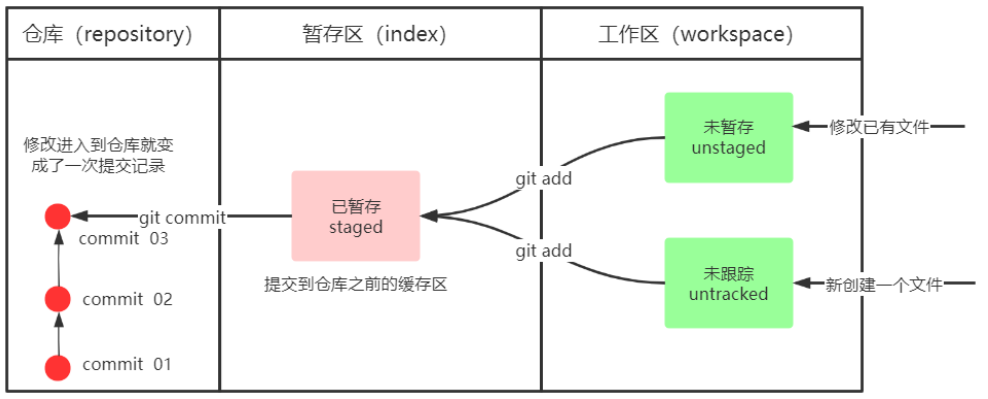
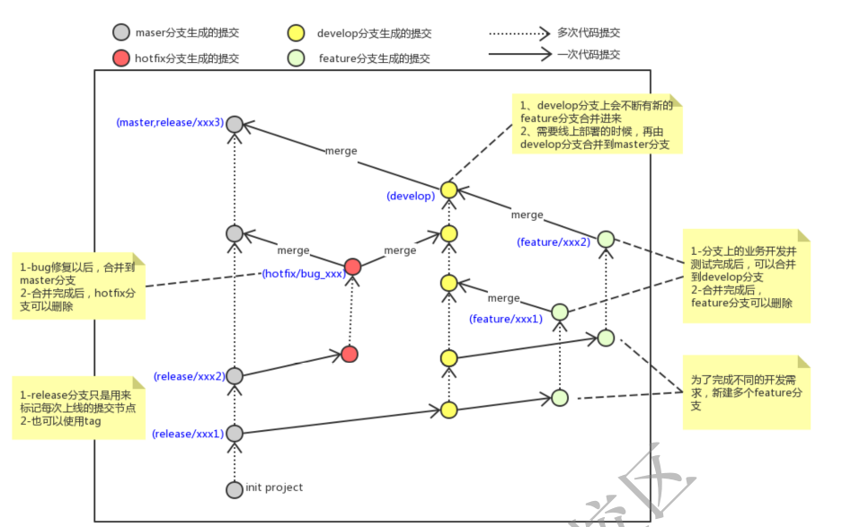

# git 学习

## 基本配置

### 基本配置

1. 打开 Git Bash

2. 设置用户信息：随意，但是必须设置。**签名的作用是区分不同作者身份**

   ```
   git config --global user.name "herrluk"		//设置用户名
   git config --global user.email "hello@em.com"	//设置邮箱
   //查看配置信息
   git config --global user.name(user.email)
   ```

3.为常用命令配置别名

1. 打开用户目录，创建  `.bashrc` 文件

   ```
   #创建文件
   touch .bashrc
   ```

2. 在 `.bashrc` 文件中输入如下内容：

   ```
   #用于输出当前目录所有文件及基本信息 
   alias ll='ls -al'
   ```

3. 打开 gitBash，执行 `source ~/.bashrc`

### 获取本地仓库

要使用Git对我们的代码进行版本控制，首先需要获得本地仓库

1. 在电脑的任意位置创建一个空目录（例如test）作为我们的本地Git仓库
2. 进入这个目录中，点击右键打开Git bash窗口
3. 执行命令git init
4. 如果创建成功后可在文件夹下看到隐藏的.git目录。

### 基础操作命令

Git工作目录下对于文件的**修改**(增加、删除、更新)会存在几个状态，这些**修改**的状态会随着我们执行Git的命令而发生变化。

#### 初始化 Git

- 作用：初始化 Git
- 命令：`git init`



本章节主要讲解如何使用命令来控制这些状态之间的转换：

```
git add (工作区 --> 暂存区) 
git commit (暂存区 --> 本地仓库)
```

#### 查看修改的状态（status）

- 作用：查看的修改的状态（暂存区、工作区）
- 命令形式：`git status`

#### 添加工作区到暂存区(add)

- 作用：添加工作区一个或多个文件的修改到暂存区
- 命令形式：`git add 单个文件名|通配符`
- 将所有修改加入暂存区：`git add .`

#### 提交暂存区到本地仓库**(commit)**

- 作用：提交暂存区内容到本地仓库的当前分支
- 命令形式：`git commit -m '注释内容' 文件名`

#### 查看提交日志（log）

- 作用：查看提交记录
- 命令形式：`git log [option]`

options：

- `--all` 显示所有分支
- `--pretty=oneline` 将提交信息显示为一行
- `--abbrev-commit` 使得输出的commitId更简短
- `--graph` 以图的形式显示

#### 版本回退

- 作用：版本切换
- 命令形式：`git reset --hard commitID`
  - commitID 可以使用 git-log 或 git log 指令查看

- 如何查看已经删除的记录？
  - `git reflog`
  - 这个指令可以看到已经删除的提交记录

#### 添加文件至忽略列表

一般我们总会有些文件无需纳入Git 的管理，也不希望它们总出现在未跟踪文件列表。 通常都是些自动生成的文件，比如日志文件，或者编译过程中创建的临时文件等。 在这种情况下，我们可以在工作目录中创建一个名为 `.gitignore` 的文件（文件名称固定），列出要忽略的文件模式。

```bash
# no .a files 
*.a 
# but do track lib.a, even though you're ignoring .a files above 
!lib.a 
# only ignore the TODO file in the current directory, not subdir/TODO 
/TODO 
# ignore all files in the build/ directory 
build/ 
# ignore doc/notes.txt, but not doc/server/arch.txt 
doc/*.txt 
# ignore all .pdf files in the doc/ directory 
doc/**/*.pdf
```

### 分支

几乎所有的版本控制系统都以某种形式支持分支。 使用分支意味着你可以把你的工作从开发主线上分离开来进行重大的Bug修改、开发新的功能，以免影响开发主线。分支的底层也是指针。

#### 查看本地分支

命令：`git branch`

#### 创建本地分支

命令：`git branch` 分支名

#### 切换分支(checkout)

命令：`git checkout 分支名`
我们还可以直接切换到一个不存在的分支（创建并切换）
命令：`git checkout -b 分支名`

#### 合并分支(merge)

一个分支上的提交可以合并到另一个分支
命令：`git merge 分支名称`

#### 删除分支

不能删除当前分支，只能删除其他分支
`git branch -d b1` 删除分支时，需要做各种检查
`git branch -D b1` 不做任何检查，强制删除

#### 解决冲突

当两个分支上对文件的修改可能会存在冲突，例如同时修改了同一个文件的同一行，这时就需要手动解决冲突，解决冲突步骤如下：

1. 处理文件中冲突的地方（修改文件，决定保存的内容）
2. 将解决完冲突的文件加入暂存区(add)
3. 提交到仓库(commit)

#### 开发中分支使用原则与流程

几乎所有的版本控制系统都以某种形式支持分支。 使用分支意味着你可以把你的工作从开发主线上分离开来进行重大的Bug修改、开发新的功能，以免影响开发主线。

在开发中，一般有如下分支使用原则与流程：

- master （生产）分支

  线上分支，主分支，中小规模项目作为线上运行的应用对应的分支；

- develop（开发）分支

  是从master创建的分支，一般作为开发部门的主要开发分支，如果没有其他并行开发不同期上线要求，都可以在此版本进行开发，阶段开发完成后，需要是合并到master分支,准备上线。

- feature/xxxx分支

  从develop创建的分支，一般是同期并行开发，但不同期上线时创建的分支，分支上的研发任务完成后合并到develop分支。

- hotfifix/xxxx分支

  从master派生的分支，一般作为线上bug修复使用，修复完成后需要合并到master、test、develop分支。

还有一些其他分支，在此不再详述，例如test分支（用于代码测试）、pre分支（预上线分支）等等。



### Git 远程仓库

#### 操作远程仓库

##### 添加远程仓库

此操作是先初始化本地库，然后与已创建的远程库进行对接。
命令： `git remote add <远端名称(别名)> <仓库路径（远程地址）>`

- 远端名称，默认是origin，取决于远端服务器设置

- 仓库路径，从远端服务器获取此URL

- 例如: 

  ```
  git remote add ori https://github.com/atguiguyueyue/git-shTest.git
  ```

  

##### 查看远程仓库

命令：`git remote` `git remote -v` 查看当前所有远程地址别名

##### 推送到远程仓库

命令：`git push [-f] [--set-upstream] [远端名称（别名） [本地分支名][:远端分支名] ]`

- 如果远程分支名和本地分支名称相同，则可以只写本地分支
  - ​	`git push origin master`
- `-f` 表示强制覆盖
- `--set-upstream` 推送到远端的同时并且建立起和远端分支的关联关系。
  - ​	`git push --set-upstream origin master`
- 如果当前分支已经和远端分支关联，则可以省略分支名和远端名。
  - ​	`git push` 将master分支推送到已关联的远端分支。

##### 本地分支与远程分支的关联关系

查看关联关系我们可以使用 `git branch -vv` 命令

##### 从远程仓库克隆

如果已经有一个远端仓库，我们可以直接clone到本地。
命令: `git clone <仓库路径> [本地目录]`
本地目录可以省略，会自动生成一个目录

##### 从远程仓库中抓取和拉取

远程分支和本地的分支一样，我们可以进行merge操作，只是需要先把远端仓库里的更新都下载到本地，再进行操作。

- 抓取 命令：`git fetch [remote name] [branch name]`

  抓取指令就是**将仓库里的更新都抓取到本地，不会进行合并**

  如果不指定远端名称和分支名，则抓取所有分支。

- 拉取 命令：`git pull [remote name] [branch name]`

  拉取指令就是**将远端仓库的修改拉到本地并自动进行合并**，等同于fetch+merge

  如果不指定远端名称和分支名，则抓取所有并更新当前分支。

##### 解决合并冲突

在一段时间，A、B用户修改了同一个文件，且修改了同一行位置的代码，此时会发生合并冲突。

A用户在本地修改代码后优先推送到远程仓库，此时B用户在本地修订代码，提交到本地仓库后，也需要推送到远程仓库，此时B用户晚于A用户，**故需要先拉取远程仓库的提交，经过合并后才能推送到远端分支**,如下图所示。

## IDEA集成 Git

### 配置 Git 忽略文件

问题 1:为什么要忽略他们？

答：与项目的实际功能无关，不参与服务器上部署运行。把它们忽略掉能够屏蔽 IDE 工具之间的差异。

问题 2：怎么忽略？

1. 创建忽略规则文件 xxxx.ignore（前缀名随便起，建议是 git.ignore）这个文件的存放位置原则上在哪里都可以，为了便于让~/.gitconfig 文件引用，建议也放在用户家目录下

   1. git.ignore 文件模版内容如下：

   ```
   # Compiled class file
   *.class
   
   # Log file
   *.log
   
   # BlueJ files
   *.ctxt
   
   # Mobile Tools for Java (J2ME)
   .mtj.tmp/
   
   # Package Files #
   *.jar
   *.war
   *.nar
   *.ear
   *.zip
   *.tar.gz
   *.rar
   
   # virtual machine crash logs, see 
   http://www.java.com/en/download/help/error_hotspot.xml
   hs_err_pid*
   .classpath
   .project
   .settings
   target
   .idea
   *.iml
   ```

2. 在.gitconfig 文件中引用忽略配置文件）/Users/jinchengwu/.gitconfig

```
[user]
name = Layne
email = Layne@atguigu.com
[core]
excludesfile = /Users/jinchengwu/git.ignore
```


# anaconda

## 安装与卸载

## 创建新环境

1. `conda create` 可以用来创建新的 conda 环境，其格式如下：

```
conda create [-n env_name | -p path] [--clone env_name] [-c channel_address] [packages]
```


`-n, --name`：我们可以根据环境名称来创建一个 conda 环境，假设我们的环境名称为 my_env

```
conda create -n my_env
```

创建完成后，我们使用如下命令进入该环境

```
conda activate my_env
```

此时命令行前面多了一个 (my_env)，这个是我们进入了该环境的标志。

2. 使用 `conda list` 命令来查看该环境下都安装了哪些包。

因为我们并没有在创建环境的时候安装包，所以结果自然是什么都没有。

3. 如果要退出该环境，只需执行`conda deactivate`
   注意： 我们只能退到基环境，在基环境下继续退出依然在基环境。

4. 查看当前存在哪些虚拟环境

   ```cobol
   conda env list 
   conda info -e
   ```

## 安装包

1. `conda install` 可以用来在 conda 环境中安装相应的包，具体格式如下：

   ```
   conda install [-n env_name | -p path] [-c channel_address] [packages]
   ```

   也可以直接指定环境安装：

   ```python
   conda install -n my_env python=3.9.7 # 根据名称
   conda install -p G:\anaconda3\envs\my_env python=3.9.7 # 根据地址
   ```

2. `conda remove` 可以用来移除 conda 环境中的某些包，也可以移除整个环境，具体格式如下：

   ```
   conda remove [-n env_name | -p path] [packages] [--all]
   ```

   如果我们需要移除 `my_env` 下的 `numpy`，只需执行

   ```bash
   conda remove -n my_env numpy
   ```

   当然我们也可以移除所有包（即整个conda环境）：

   ```
   conda remove -n my_env --all
   ```

3. `conda update` 用来将一系列的包升级到最新版本，具体格式如下：

   ```
   conda update [-n env_name | -p path] [packages] [--all]
   ```

4. 如果要更新 `conda` 本身，则需执行

   ```bash
   conda update conda
   1
   ```

   如果要更新 `anaconda` ，则需执行

   ```bash
   conda update anaconda
   1
   ```

   > **注：** 升级 `Anaconda` 前需要先升级 `conda`。

5. 换源：

   conda当前的源设置在$HOME/.condarc中，可通过文本查看器查看或者使用命令>conda config --show-sources查看。

   ```
   conda config --show-sources #查看当前使用源
   conda config --remove channels 源名称或链接 #删除指定源
   conda config --add channels 源名称或链接 #添加指定源
   ```

   

   ```
   conda config --add channels  https://mirrors.tuna.tsinghua.edu.cn/anaconda/pkgs/free/
   conda config --add channels  https://mirrors.tuna.tsinghua.edu.cn/anaconda/cloud/conda-forge/
   
   ```

   
