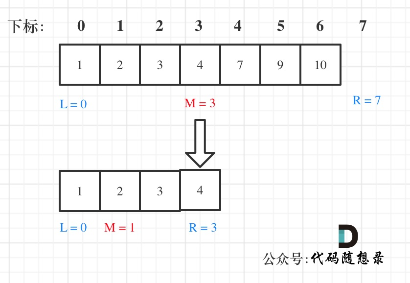

# 基础算法

## 数组

### 二分查找

二分查找涉及的很多的边界条件，逻辑比较简单，但就是写不好。例如到底是 `while(left < right)` 还是 `while(left <= right)`，到底是`right = middle`呢，还是要`right = middle - 1`呢？

大家写二分法经常写乱，主要是因为**对区间的定义没有想清楚，区间的定义就是不变量**。要在二分查找的过程中，保持不变量，就是在while寻找中每一次边界的处理都要坚持根据区间的定义来操作，这就是**循环不变量**规则。

写二分法，区间的定义一般为两种，左闭右闭即[left, right]，或者左闭右开即[left, right)。

#### 二分法第一种写法

第一种写法，我们定义 target 是在一个在左闭右闭的区间里，**也就是[left, right] （这个很重要非常重要）**。

区间的定义这就决定了二分法的代码应该如何写，**因为定义target在[left, right]区间，所以有如下两点：**

- while (left <= right) 要使用 <= ，因为left == right是有意义的，所以使用 <=
- `if (nums[middle] > target)` ` right` 要赋值为 `middle - 1`，因为当前这个`nums[middle]`一定不是`target`，那么接下来要查找的左区间结束下标位置就是 `middle - 1`

例如在数组：1,2,3,4,7,9,10中查找元素2，如图所示：


```go
func search(nums []int, target int) int {
	high := len(nums) - 1
	low := 0
	for low <= high {
		// 防止溢出 等同于(left + right)/2
		mid := low + (high-low)/2
		if nums[mid] == target {
			return mid
		} else if nums[mid] > target {
			high = mid - 1
		} else {
			low = mid + 1
		}
	}
	return -1
}

```


#### 二分法第二种写法

如果说定义 target 是在一个在左闭右开的区间里，也就是[left, right) ，那么二分法的边界处理方式则截然不同。

有如下两点：

- while (left < right)，这里使用 < ,因为left == right在区间[left, right)是没有意义的
- if (nums[middle] > target) `right` 更新为 middle，因为当前nums[middle]不等于target，去左区间继续寻找，而寻找区间是左闭右开区间，所以right更新为middle，即：**下一个查询区间不会去比较nums[middle]**

在数组：1,2,3,4,7,9,10中查找元素2，如图所示：（**注意和方法一的区别**）



代码如下：（详细注释）

```go
func search(nums []int, target int) int {
    high := len(nums)
    low := 0
    for low < high {
        mid := low + (high-low)/2
        if nums[mid] == target {
            return mid
        } else if nums[mid] > target {
            high = mid
        } else {
            low = mid+1
        }
    }
    return -1
}
```


#### 总结

二分法是非常重要的基础算法，为什么很多同学对于二分法都是**一看就会，一写就废**？

其实主要就是对区间的定义没有理解清楚，在循环中没有始终坚持根据查找区间的定义来做边界处理。

区间的定义就是不变量，那么在循环中坚持根据查找区间的定义来做边界处理，就是循环不变量规则。

本篇根据两种常见的区间定义，给出了两种二分法的写法，每一个边界为什么这么处理，都根据区间的定义做了详细介绍。

相信看完本篇应该对二分法有更深刻的理解了。

### 移除元素

#### 力扣 27.移除元素

[力扣题目链接(opens new window)](https://leetcode.cn/problems/remove-element/)

#### 暴力解法

这个题目暴力的解法就是两层for循环，一个for循环遍历数组元素 ，第二个for循环更新数组。

删除过程如下：


很明显暴力解法的时间复杂度是O(n^2)，这道题目暴力解法在leetcode上是可以过的。

#### 双指针法

双指针法（快慢指针法）： **通过一个快指针和慢指针在一个for循环下完成两个for循环的工作。**

定义快慢指针

- 快指针：寻找新数组的元素 ，新数组就是不含有目标元素的数组
- 慢指针：指向更新 新数组下标的位置

很多同学这道题目做的很懵，就是不理解 快慢指针究竟都是什么含义，所以一定要明确含义，后面的思路就更容易理解了。

删除过程如下：


很多同学不了解

**双指针法（快慢指针法）在数组和链表的操作中是非常常见的，很多考察数组、链表、字符串等操作的面试题，都使用双指针法。**

```go
func removeElement(nums []int, val int) int {
    length:=len(nums)
    res:=0
    for i:=0;i<length;i++{
        if nums[i]!=val {
            nums[res]=nums[i]
            res++
        }
    }
    nums=nums[:res]
    return res
}

```

### 有序数组的平方

#### 977.有序数组的平方

[力扣题目链接](https://leetcode.cn/problems/squares-of-a-sorted-array/)

给你一个按 **非递减顺序** 排序的整数数组 `nums`，返回 **每个数字的平方** 组成的新数组，要求也按 **非递减顺序** 排序。

  

**示例 1：**

```txt
输入：nums = [-4,-1,0,3,10]
输出：[0,1,9,16,100]
解释：平方后，数组变为 [16,1,0,9,100]
排序后，数组变为 [0,1,9,16,100]
```

**示例 2：**

```txt
输入：nums = [-7,-3,2,3,11]
输出：[4,9,9,49,121]
```


**提示：**

-   `1 <= nums.length <= 10^4`
-   `-10^4 <= nums[i] <= 10^4`
-   `nums` 已按 **非递减顺序** 排序

  

**进阶：**

-   请你设计时间复杂度为 `O(n)` 的算法解决本问题

##### 方法一：直接排序

思路与算法

最简单的方法就是将数组 nums中的数平方后直接排序。

代码

```go
func sortedSquares(nums []int) []int {
    ans := make([]int, len(nums))
    for i, v := range nums {
        ans[i] = v * v
    }
    sort.Ints(ans)
    return ans
}
```


小结：

使用了 `sort` 包的 `INts` 函数将a排序为递增顺序。

```
func Ints(a []int)
```

复杂度分析

时间复杂度：这个时间复杂度是 O(n + nlogn) ，其中 n 是数组 nums 的长度。

空间复杂度：O(logn)。除了存储答案的数组以外，我们需要 O(logn) 的栈空间进行排序。

##### 方法二：双指针法

方法一没有利用「数组 nums 已经按照升序排序」这个条件。显然，如果数组 nums 中的所有数都是非负数，那么将每个数平方后，数组仍然保持升序；如果数组 nums 中的所有数都是负数，那么将每个数平方后，数组会保持降序。

这样一来，如果我们能够找到数组 *nums*中负数与非负数的分界线，那么就可以用类似「归并排序」的方法了。具体地，我们设*neg* 为数组 *nums*中负数与非负数的分界线，也就是说，*nums*\[0\] 到*nums*\[*neg*\] 均为负数，而 *nums*\[*neg*+1\]到 *nums*\[n-1\]均为非负数。当我们将数组 *nums*中的数平方后，那么 *nums*\[0\] 到 *nums*\[*neg*\]单调递减，*nums*\[*neg*+1\] 到 *nums*\[n-1\]单调递增。

由于我们得到了两个已经有序的子数组，因此就可以使用归并的方法进行排序了。具体地，使用两个指针分别指向位置*neg* 和*neg*+1，每次比较两个指针对应的数，选择较小的那个放入答案并移动指针。当某一指针移至边界时，将另一指针还未遍历到的数依次放入答案。


不难写出如下代码：

```cpp
func sortedSquares(nums []int) []int {
	n := len(nums)

	// 找最后一个非负数的下标
	lastNegIndex := -1
	for i := 0; i < n && nums[i] < 0; i++ {
		lastNegIndex = i
	}

	ans := make([]int, 0, n)
	// 从正负分隔点开始排序 i 为最后一个负数 j 为第一个非负数
	
	for i, j := lastNegIndex, lastNegIndex+1; i >= 0 || j < n; {
		if i < 0 {// i如果小于 0 说明全部是非负数 直接排序
			ans = append(ans, nums[j]*nums[j])
			j++
		} else if j == n {	// 当 i>=0 且 j==n 时，说明非负数排到边界了
			// 将另一指针还未遍历到的放入答案
			ans = append(ans, nums[i]*nums[i])
			i--
		} else if nums[i]*nums[i] < nums[j]*nums[j] {	//左指针小 放入答案 
			ans = append(ans, nums[i]*nums[i])
			i--	//左指针向左移动
		} else {	// 右指针小，放入答案
			ans = append(ans, nums[j]*nums[j])
			j++	//右指针向右移动
		}
	}

	return ans
}
```

复杂度分析

时间复杂度：O(n)，其中 n 是数组 *nums* 的长度。

空间复杂度：O(1)。除了存储答案的数组以外，我们只需要维护常量空间。

##### 方法三：双指针

思路与算法

同样地，我们可以使用两个指针分别指向位置 0 和 n-1，每次比较两个指针对应的数，选择较大的那个**逆序**放入答案并移动指针。这种方法无需处理某一指针移动至边界的情况，读者可以仔细思考其精髓所在。

```go
func sortedSquares(nums []int) []int {
   n := len(nums)
   ans := make([]int, n)
   i, j := 0, n-1

   // pos指向最后一位
   for pos := n - 1; pos >= 0; pos-- {
      // 将较大的逆序放入答案
      if v, w := nums[i]*nums[i], nums[j]*nums[j]; v > w {
         ans[pos] = v
         i++
      } else {
         ans[pos] = w
         j--
      }
   }
   return ans
}
```

复杂度分析  

时间复杂度：O(n)，其中 nn 是数组nums 的长度。  

空间复杂度：O(1)。除了存储答案的数组以外，我们只需要维护常量空间。

### 长度最小的子数组

[力扣题目链接](https://leetcode.cn/problems/minimum-size-subarray-sum/)

#### 209.长度最小的子数组

#### 方法一：暴力法

暴力法是最直观的方法。初始化子数组的最小长度为无穷大，枚举数组 nums中的每个下标作为子数组的开始下标，对于每个开始下标i，需要找到大于或等于 i 的最小下标 j，使得从 nums\[i] 到nums\[j] 的元素和大于或等于s，并更新子数组的最小长度（此时子数组的长度是 j-i+1）。

```go
func minSubArrayLen(s int, nums []int) int {
    n := len(nums)
    if n == 0 {
        return 0
    }
    ans := math.MaxInt32
    for i := 0; i < n; i++ {
        sum := 0
        for j := i; j < n; j++ {
            sum += nums[j]
            if sum >= s {
                ans = min(ans, j - i + 1)
                break
            }
        }
    }
    if ans == math.MaxInt32 {
        return 0
    }
    return ans
}

func min(x, y int) int {
    if x < y {
        return x
    }
    return y
}
```

复杂度分析

时间复杂度：O(n^2)，其中 n 是数组的长度。需要遍历每个下标作为子数组的开始下标，对于每个开始下标，需要遍历其后面的下标得到长度最小的子数组。

空间复杂度：O(1)。

#### 方法二：前缀和 + 二分查找 

方法一的时间复杂度是 O(n2)，因为在确定每个子数组的开始下标后，找到长度最小的子数组需要 O(n)的时间。如果使用二分查找，则可以将时间优化到 O(n)O(logn)。

为了使用二分查找，需要额外创建一个数组 sums 用于存储数组 nums 的前缀和，其中 sums\[i\] 表示从 nums\[0\] 到nums\[i−1\] 的元素和。得到前缀和之后，对于每个开始下标 i，可通过二分查找得到大于或等于 i 的最小下标 *bound*，使得
*sums\[bound\]−sums\[i−1\]≥s*，并更新子数组的最小长度（此时子数组的长度是
bound−(i−1)）。

因为这道题保证了数组中每个元素都为正，所以前缀和一定是递增的，这一点保证了二分的正确性。如果题目没有说明数组中每个元素都为正，这里就不能使用二分来查找这个位置了。

```go
package main

import (
	"math"
	"sort"
)

func minSubArrayLen(s int, nums []int) int {
	n := len(nums)
	if n == 0 {
		return 0
	}
	ans := math.MaxInt32
	sums := make([]int, n+1)
	// 为了方便计算，令 size = n + 1
	// sums[0] = 0 意味着前 0 个元素的前缀和为 0
	// sums[1] = A[0] 前 1 个元素的前缀和为 A[0]
	// 以此类推
	for i := 1; i <= n; i++ {
		sums[i] = sums[i-1] + nums[i-1]
	}
	for i := 1; i <= n; i++ {
		target := s + sums[i-1]
		// SearchInts在递增顺序的sums中搜索target，返回target的索引。
		// 如果查找不到，返回值是target应该插入sums的位置（以保证sums的递增顺序），返回值可以是len(sums)。
		bound := sort.SearchInts(sums, target)

		// 题解二分查找中java的binarySearch方法返回有两种：
		// 一种是刚好找到目标值，返回目标值的下标。
		// 一种是找不到目标值，则会返回比目标值大的元素的下标，下标带有负数，且从1开始数起。
		// 例如一个数组有3个元素，但是查找的元素值比那三个元素都大，则会返回-4
		if bound < 0 {	//插入到所有元素后面
			bound = -bound - 1
		}
		if bound <= n {	// 查找到或者插入位置合法，返回 bound 和ans 的最小
			ans = min(ans, bound-(i-1))
		}
	}
	if ans == math.MaxInt32 {
		return 0
	}
	return ans
}

func min(x, y int) int {
	if x < y {
		return x
	}
	return y
}

```

复杂度分析

时间复杂度：O(nlogn)，其中 n 是数组的长度。需要遍历每个下标作为子数组的开始下标，遍历的时间复杂度是 O(n)，对于每个开始下标，需要通过二分查找得到长度最小的子数组，二分查找得时间复杂度是 O(logn)，因此总时间复杂度是 O(nlogn)。

空间复杂度：O(n)，其中 nn 是数组的长度。额外创建数组 sums 存储前缀和。

#### 方法三：滑动窗口

在方法一和方法二中，都是每次确定子数组的开始下标，然后得到长度最小的子数组，因此时间复杂度较高。为了降低时间复杂度，可以使用滑动窗口的方法。

定义两个指针 start 和 \end 分别表示子数组（滑动窗口窗口）的开始位置和结束位置，维护变量 sum 存储子数组中的元素和（即从nums[start] 到 nums[end] 的元素和）。

初始状态下，start 和 end 都指向下标 0，sum 的值为 0。

每一轮迭代，将 nums[end] 加到 sum，如果 sum >= s，则更新子数组的最小长度（此时子数组的长度是 end−start+1 ），然后将 nums[start] 从 sum 中减去并将 start 右移，直到 sum<s，在此过程中同样更新子数组的最小长度。在每一轮迭代的最后，将 end 右移。


```go
func minSubArrayLen(target int, nums []int) int {
    i := 0
    l := len(nums)  // 数组长度
    sum := 0        // 子数组之和
    result := l + 1 // 初始化返回长度为l+1，目的是为了判断“不存在符合条件的子数组，返回0”的情况
    for j := 0; j < l; j++ {
        sum += nums[j]
        for sum >= target {
            subLength := j - i + 1
            if subLength < result {
                result = subLength
            }
            sum -= nums[i]
            i++
        }
    }
    if result == l+1 {
        return 0
    } else {
        return result
    }
}
```

### 螺旋矩阵

[力扣题目链接](https://leetcode.cn/problems/spiral-matrix-ii/)

### 替换空格

方法 1：遍历添加

```go
// 遍历添加
func replaceSpace(s string) string {
    b := []byte(s)
    result := make([]byte, 0)
    for i := 0; i < len(b); i++ {
        if b[i] == ' ' {
            result = append(result, []byte("%20")...)
        } else {
            result = append(result, b[i])
        }
    }
    return string(result)
}


```

知识点：

1. 内建函数`append()`可以为切片动态添加元素。 可以一次添加一个元素，可以添加多个元素，*也可以添加另一个切片中的元素（后面加`...`）*。

方法 2：原地修改 时间：n 	空间：1

Go版本：

```go
// 原地修改
func replaceSpace(s string) string {
    b := []byte(s)
    length := len(b)
    spaceCount := 0
    // 计算空格数量
    for _, v := range b {
        if v == ' ' {
            spaceCount++
        }
    }
    // 扩展原有切片
    resizeCount := spaceCount * 2
    tmp := make([]byte, resizeCount)
    b = append(b, tmp...)
    i := length - 1
    j := len(b) - 1
    for i >= 0 {
        if b[i] != ' ' {
            b[j] = b[i]
            i--
            j--
        } else {
            b[j] = '0'
            b[j-1] = '2'
            b[j-2] = '%'
            i--
            j = j - 3
        }
    }
    return string(b)
}
```

C++版本：

```c++
class Solution {
public:
    string replaceSpace(string s) {
        int count = 0; // 统计空格的个数
        int sOldSize = s.size();
        for (int i = 0; i < s.size(); i++) {
            if (s[i] == ' ') {
                count++;
            }
        }
        // 扩充字符串s的大小，也就是每个空格替换成"%20"之后的大小
        s.resize(s.size() + count * 2);
        int sNewSize = s.size();
        // 从后先前将空格替换为"%20"
        for (int i = sNewSize - 1, j = sOldSize - 1; j < i; i--, j--) {
            if (s[j] != ' ') {
                s[i] = s[j];
            } else {
                s[i] = '0';
                s[i - 1] = '2';
                s[i - 2] = '%';
                i -= 2;
            }
        }
        return s;
    }
};

```

### 反转链表

方法 1：递归法

C++

```c++
class Solution {
public:
    vector<int> reversePrint(ListNode* head) {
        recur(head);
        return res;
    }
private:
    vector<int> res;
    void recur(ListNode* head) {
        if(head == nullptr) return;
        recur(head->next);
        res.push_back(head->val);
    }
};


```

Go

```go
func reversePrint(head *ListNode) ([]int) {
	if head == nil {return nil}
	return append(reversePrint(head.Next), head.Val)
}
```

方法 2：辅助栈法

```c++
class Solution {
public:
    vector<int> reversePrint(ListNode* head) {
        stack<int> stk;
        while(head != nullptr) {
            stk.push(head->val);
            head = head->next;
        }
        vector<int> res;
        while(!stk.empty()) {
            res.push_back(stk.top());
            stk.pop();
        }
        return res;
    }
};

```

Go

```go
import "container/list"

func reversePrint(head *ListNode) []int {
    if head == nil {
        return nil
    }

    res := list.New()
    for head != nil {
        res.PushFront(head.Val)
        head = head.Next
    }

    ret := []int{}
    for e := res.Front(); e != nil; e = e.Next() {
        ret = append(ret, e.Value.(int))
    }

    return ret
}
```

方法 3：遍历两次链表

Go

```go
func reversePrint(head *ListNode) []int {
	cur := head //备份链表
	n := 0
	//遍历链表记录链表数
	for head != nil {
		head = head.Next
		n++
	}
	//再次遍历链表逆序摆放进数组
	nums := make([]int, n) //申请一个数组,n可作用在这里预申请空间,大大减少了内存消耗
	for {
		if cur == nil {
			break
		}
		nums[n-1] = cur.Val
		cur = cur.Next
		n--
	}
	return nums
}
```

### 用两个栈实现队列

#### 方法 1 双栈

题目只要求实现 加入队尾appendTail() 和 删除队首deleteHead() 两个函数的正常工作，因此我们可以设计栈 A 用于加入队尾操作，栈 B 用于将元素倒序，从而实现删除队首元素。

1. 加入队尾 appendTail()函数： 将数字 val 加入栈 A 即可。

2. 删除队首deleteHead()函数： 有以下三种情况。

- 当栈 B 不为空： B中仍有已完成倒序的元素，因此直接返回 B 的栈顶元素。
- 否则，当 A 为空： 即两个栈都为空，无元素，因此返回 -1 −1。
- 否则： 将栈 A 元素全部转移至栈 B 中，实现元素倒序，并返回栈 B 的栈顶元素。


##### 代码

Go

使用切片

```
package leetCode

type CQueue struct {
	inStack, outStack []int
}

func Constructor() CQueue {
	return CQueue{}
}

func (q *CQueue) AppendTail(value int) {
	q.inStack = append(q.inStack, value)
}

func (q *CQueue) DeleteHead() int {
	if len(q.outStack) == 0 {
		if len(q.inStack) == 0 {
			return -1
		}
		q.in2out()
	}
	value := q.outStack[len(q.outStack)-1]
	q.outStack = q.outStack[:len(q.outStack)-1]
	return value
}

func (q *CQueue) in2out() {
	for len(q.inStack) > 0 {
		q.outStack = append(q.outStack, q.inStack[len(q.inStack)-1])
		q.inStack = q.inStack[:len(q.inStack)-1]
	}
}


```

使用 list.List

```go

type CQueue struct {
	list1, list2 *list.List //list包的List函数，是一个结构体
}

func Constructor() CQueue {
	return CQueue{
		list1: list.New(), //New函数，返回*List对象，即创建链表
		list2: list.New(),
	}
}

func (q *CQueue) AppendTail(value int) {
	q.list1.PushBack(value) //直接插入list1尾部即可
}

func (q *CQueue) DeleteHead() int {
	if q.list2.Len() == 0 { //如果list2为空就把list1的元素全部倒置放入list2中并在list1中删除
		for q.list1.Len() != 0 {
			q.list2.PushBack(q.list1.Remove(q.list1.Back()))
		}
	} //这里看似上下两个if刚好条件是相反的，但是一定不能写为if-else，因为我们要的是顺序执行而不是二选一
	
	if q.list2.Len() != 0 { //不为空就返回list2的Back并删除
		e := q.list2.Back()
		q.list2.Remove(e)
		return e.Value.(int) //注意V大写，并使用类型断言转为int型
	}
	return -1 //没有则返回默认值-1
	
}

```


### 剑指 Offer 20. 表示数值的字符串


Go

```
type State int
type CharType int

const (
    STATE_INITIAL State = iota
    STATE_INT_SIGN
    STATE_INTEGER
    STATE_POINT
    STATE_POINT_WITHOUT_INT
    STATE_FRACTION
    STATE_EXP
    STATE_EXP_SIGN
    STATE_EXP_NUMBER
    STATE_END
)

const (
    CHAR_NUMBER CharType = iota
    CHAR_EXP
    CHAR_POINT
    CHAR_SIGN
    CHAR_SPACE
    CHAR_ILLEGAL
)

func toCharType(ch byte) CharType {
    switch ch {
    case '0', '1', '2', '3', '4', '5', '6', '7', '8', '9':
        return CHAR_NUMBER
    case 'e', 'E':
        return CHAR_EXP
    case '.':
        return CHAR_POINT
    case '+', '-':
        return CHAR_SIGN
    case ' ':
        return CHAR_SPACE
    default:
        return CHAR_ILLEGAL
    }
}

func isNumber(s string) bool {
    transfer := map[State]map[CharType]State{
        STATE_INITIAL: map[CharType]State{
            CHAR_SPACE:  STATE_INITIAL,
            CHAR_NUMBER: STATE_INTEGER,
            CHAR_POINT:  STATE_POINT_WITHOUT_INT,
            CHAR_SIGN:   STATE_INT_SIGN,
        },
        STATE_INT_SIGN: map[CharType]State{
            CHAR_NUMBER: STATE_INTEGER,
            CHAR_POINT:  STATE_POINT_WITHOUT_INT,
        },
        STATE_INTEGER: map[CharType]State{
            CHAR_NUMBER: STATE_INTEGER,
            CHAR_EXP:    STATE_EXP,
            CHAR_POINT:  STATE_POINT,
            CHAR_SPACE:  STATE_END,
        },
        STATE_POINT: map[CharType]State{
            CHAR_NUMBER: STATE_FRACTION,
            CHAR_EXP:    STATE_EXP,
            CHAR_SPACE:  STATE_END,
        },
        STATE_POINT_WITHOUT_INT: map[CharType]State{
            CHAR_NUMBER: STATE_FRACTION,
        },
        STATE_FRACTION: map[CharType]State{
            CHAR_NUMBER: STATE_FRACTION,
            CHAR_EXP:    STATE_EXP,
            CHAR_SPACE:  STATE_END,
        },
        STATE_EXP: map[CharType]State{
            CHAR_NUMBER: STATE_EXP_NUMBER,
            CHAR_SIGN:   STATE_EXP_SIGN,
        },
        STATE_EXP_SIGN: map[CharType]State{
            CHAR_NUMBER: STATE_EXP_NUMBER,
        },
        STATE_EXP_NUMBER: map[CharType]State{
            CHAR_NUMBER: STATE_EXP_NUMBER,
            CHAR_SPACE:  STATE_END,
        },
        STATE_END: map[CharType]State{
            CHAR_SPACE: STATE_END,
        },
    }
    state := STATE_INITIAL
    for i := 0; i < len(s); i++ {
        typ := toCharType(s[i])
        if _, ok := transfer[state][typ]; !ok {
            return false
        } else {
            state = transfer[state][typ]
        }
    }
    return state == STATE_INTEGER || state == STATE_POINT || state == STATE_FRACTION || state == STATE_EXP_NUMBER || state == STATE_END
}


```

### 剑指offer 24 题目解析


```
/**
 * Definition for singly-linked list.
 * type ListNode struct {
 *     Val int
 *     Next *ListNode
 * }
 */
func reverseList(head *ListNode) *ListNode {
    var prev *ListNode
    curr:=head
    for curr!=nil{
        next :=curr.Next   //保存当前节点的下一个节点
        curr.Next=prev     //当前节点的下一个节点更新为前一个节点
       prev=curr            //前节点更新为现节点
        curr=next            //现节点更新为下一个节点
    }
    return prev
}
func reverseList(head *ListNode) * ListNode{
    if head==nil  || head.Next==nil{
        return head
    }
    newHead:=reverseList(head.Next)
    head.Next.Next=head
    head.Next=nil
    return newHead
}


```

### 剑指 Offer 30. 包含 min 函数的栈


```
package leetcode

type MinStack struct {
      stack, minStack []int
}


/** initialize your data structure here. */
func Constructor() MinStack {
     return MinStack{
         stack:[]int{},
         minStack:[]int{math.MaxInt64},  //最小栈初始化时要预先放入一个int的最大值
     }

}


func (this *MinStack) Push(x int)  {
     this.stack=append(this.stack,x)  //stack正常append x
     top:=this.minStack[len(this.minStack)-1]
     this.minStack=append(this.minStack,min(top,x))  //minstack append最小值
}


func (this *MinStack) Pop()  {  
     this.stack=this.stack[:len(this.stack)-1]     //使用切片方法分别删除最后一个元素
     this.minStack=this.minStack[:len(this.minStack)-1]
}


func (this *MinStack) Top() int {
      return this.stack[len(this.stack)-1]     //返回stack的末尾元素
}


func (this *MinStack) Min() int {
    return this.minStack[len(this.minStack)-1]  //返回minstack的末尾元素
}

func min(a,b int) int{   //自定义min函数

    if a>b{
        return b
    }
    return a 
}


/**
 * Your MinStack object will be instantiated and called as such:
 * obj := Constructor();
 * obj.Push(x);
 * obj.Pop();
 * param_3 := obj.Top();
 * param_4 := obj.Min();
 */

 
```

# 树

力扣二叉树题目总结


## 二叉树遍历

### [94.二叉树的中序遍历](https://leetcode.cn/problems/binary-tree-inorder-traversal/)

```
func inorderTraversal(root *TreeNode) (res []int) {
	var inorder func(node *TreeNode)
	inorder = func(node *TreeNode) {
		if node == nil {
			return
		}
		inorder(node.Left)
		res = append(res, node.Val)
		inorder(node.Right)
	}
	inorder(root)
	return
}
```


### [2331.计算布尔二叉树的值](https://leetcode.cn/problems/evaluate-boolean-binary-tree/)

解法 1：

```
func evaluateTree(root *TreeNode) bool {
	switch root.Val {
	case 0:
		return false
	case 1:
		return true
	case 2:
		return evaluateTree(root.Left) || evaluateTree(root.Right)
	case 3:
		return evaluateTree(root.Left) && evaluateTree(root.Right)
	}
	return false
}
```

解法 2：

```
func evaluateTree(root *TreeNode) bool {
	if root.Left == nil {
		return root.Val == 1
	}
	if root.Val == 2 {
		return evaluateTree(root.Left) || evaluateTree(root.Right)
	}
	return evaluateTree(root.Left) && evaluateTree(root.Right)
}
```


### [938. Range Sum of BST](https://leetcode.cn/problems/range-sum-of-bst/)


自己写的：

```
func inorderTraversal(root *TreeNode) []int {
	result := make([]int, 0)
	if root == nil {
		return result
	}
	left := inorderTraversal(root.Left)
	right := inorderTraversal(root.Right)
	
	result = append(result, left...)
	result = append(result, root.Val)
	result = append(result, right...)
	return result
}

func rangeSumBST(root *TreeNode, low int, high int) int {
	// 将中序遍历的结果存入切片中
	// Store the results of the in-order traversal into slices
	result := inorderTraversal(root)
	sum:=0
	for _,v:=range result{
		if v>=low&&v<=high {
			sum+=v
		}
	}
	return sum
}

```

解法 1：递归

```
func rangeSumBST(root *TreeNode, low int, high int) int {
	res := 0
	var dfs func(root *TreeNode)
	dfs = func(root *TreeNode) {
		if root == nil {
			return
		}
		dfs(root.Left)
		if low <= root.Val && root.Val <= high {
			res += root.Val
		} else if root.Val > high {
			return
		}

		dfs(root.Right)
	}
	dfs(root)
	return res
}

```

解法 2：迭代

迭代其实就是使用「栈」来模拟递归过程，也属于树的遍历中的常见实现形式。

一般简单的面试中如果问到树的遍历，面试官都不会对「递归」解法感到满意，因此掌握「迭代/非递归」写法同样重要。

```
func rangeSumBST(root *TreeNode, low int, high int) int {
	res := 0
	var stack []*TreeNode
	for root != nil || len(stack) > 0 {
		for root != nil {
			stack = append(stack, root)
			root = root.Left
		}
		root = stack[len(stack)-1]
		stack = stack[:len(stack)-1]
		if low <= root.Val && root.Val <= high {
			res += root.Val
		} else if root.Val > high {
			break
		}
		root = root.Right
	}
	return res
}


```


### [剑指 Offer 27. 二叉树的镜像](https://leetcode.cn/problems/er-cha-shu-de-jing-xiang-lcof/)

```
func mirrorTree(root *TreeNode) *TreeNode {
    if root == nil {
        return nil
    }
    left := mirrorTree(root.Left)
    right := mirrorTree(root.Right)
    root.Left = right
    root.Right = left
    return root
}
```

